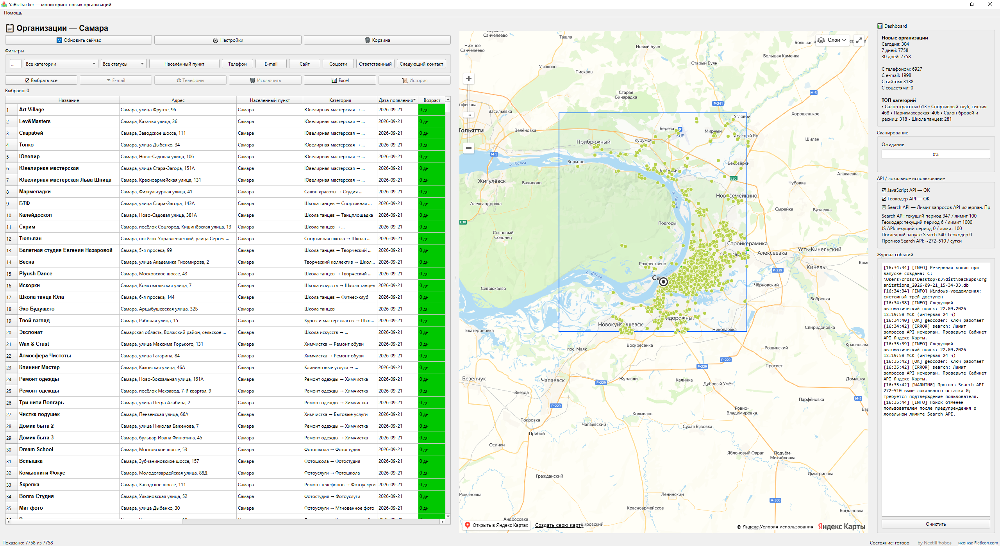

# YaBizTracker

## 📸 Скриншоты / Screenshots

### Главное окно / Main window


### Окно настроек ч.1 / Setting's window part 1


### Окно настроек ч.2 / Setting's window part 2


## Русская версия

YaBizTracker — локальное Windows-приложение для поиска новых организаций и контактных данных через Yandex Maps API. Программа предназначена для маркетологов и специалистов по продажам: она сохраняет историю обнаружения организаций, отслеживает новые результаты, предоставляет фильтры и CRM-поля, показывает организации на карте и умеет собирать публичные e-mail с сайтов организаций.

Приложение рассчитано на работу одного пользователя на локальном компьютере. Основные данные хранятся в SQLite, плановые поиски выполняются в фоне, отдельный сервер приложения не требуется.

## Возможности

- Поиск организаций по населённому пункту и категориям Yandex Maps.
- Поддержка нескольких населённых пунктов и включаемых/исключаемых категорий.
- Исключение организации, если любая её категория Yandex соответствует исключённой категории.
- Сохранение контактов, сайта, социальных сетей, координат и статуса источника.
- CRM-поля: статус, комментарий, ответственный и следующий контакт.
- Фильтрация, сортировка, Shift-мультивыбор и массовое изменение CRM-полей.
- Три состояния фильтров **Телефон, E-mail, Сайт, Соцсети, Ответственный, Следующий контакт**: первый клик показывает записи с заполненным значением, второй — без значения, третий отключает фильтр.
- Отдельная колонка **Населённый пункт** и фильтр в виде многовыборного checkbox-dropdown только по настроенным населённым пунктам.
- Копирование e-mail и телефонов выбранных организаций в буфер обмена.
- Отображение организаций на Yandex Maps.
- Учёт API-запросов и настраиваемых локальных лимитов.
- Ручной и автоматический запуск поиска через APScheduler.
- Возобновление прерванного поиска постранично по устойчивым SQLite-чекпоинтам.
- Восстанавливаемая корзина с политикой хранения 30 дней.
- Резервное копирование SQLite и проверка резервных копий.
- Экспорт в XLSX с независимым fallback-записывателем.
- Диагностика, ротация логов и отчёты о падениях.

## Архитектура

```text
                    ┌─────────────────────────────┐
                    │          PyQt6 UI            │
                    │ MainWindow / dialogs/widgets │
                    └──────────────┬──────────────┘
                                   │
                    ┌──────────────▼──────────────┐
                    │          Services            │
                    │ scan / backup / export /     │
                    │ settings / API usage         │
                    └───────┬───────────┬─────────┘
                            │           │
                 ┌──────────▼───┐   ┌──▼───────────┐
                 │ Domain rules │   │ Yandex API   │
                 │ filters      │   │ clients      │
                 │ categories   │   │ retry/errors │
                 │ selection    │   └──────┬────────┘
                 │ scan identity│          │
                 └──────────────┘          │
                            │               │
                       ┌────▼───────────────▼───┐
                       │       SQLite            │
                       │ organizations            │
                       │ CRM history              │
                       │ trash / ignore tombstone │
                       │ scan checkpoints         │
                       │ per-category liveness    │
                       └──────────────────────────┘
```

### Архитектурные решения

**Бизнес-логика не зависит от Qt.** Фильтрация, сопоставление категорий, семантика выбора и сигнатуры поиска находятся в `yabiztracker/domain/` и напрямую покрываются unit-тестами.

**Таблица организаций имеет явный контракт колонок.** `domain/table.py` хранит стабильные индексы колонок и не допускает разрастания разрозненных magic numbers в UI.

**UI разделён по ответственности.** `main_window.py` отвечает за оркестрацию приложения, а диалоги, делегаты, виджеты и worker-потоки вынесены в отдельные модули.

**Живость данных отслеживается по городу и категории поиска.** Глобальный счётчик пропусков небезопасен, потому что одна организация может одновременно относиться к нескольким категориям. Таблица `organization_category_observations` не позволяет удалить лид только потому, что он исчез из одного запроса, оставаясь видимым в другом.

**Записи SQLite транзакционные.** Upsert организации и наблюдения по категориям для обработанной страницы фиксируются вместе. Изменения CRM, операции корзины, миграции и чекпоинты также выполняются транзакционно.

**Сверка результатов консервативна.** Организация не удаляется после одного неполного результата. Для reconciliation требуется завершённый неусечённый поиск и несколько последовательных пропусков; активные CRM-лиды защищены.

**Runtime-состояние не входит в репозиторий.** API-ключи, настройки, SQLite-базы, данные использования API, резервные копии и логи создаются во время работы и исключены из Git.

## Структура проекта

```text
.
├── yabiztracker/
│   ├── api/              # клиенты Yandex API и типизированные ошибки
│   ├── database/         # SQLite-схема, миграции и persistence
│   ├── domain/           # независимые от фреймворков бизнес-правила
│   ├── services/         # прикладные сервисы
│   └── ui/               # Qt-окна, диалоги, виджеты, делегаты, workers
├── tests/                # unit, integration и regression tests
├── main.py               # тонкая точка входа приложения
├── YaBizTracker.spec     # описание сборки PyInstaller
├── build_windows.bat     # Windows bootstrap сборки и тестов
├── pyproject.toml        # метаданные проекта, pytest и Ruff
├── requirements.txt      # runtime-зависимости
├── icon.png / icon.ico   # брендирование приложения
├── LICENSE
└── README.md
```

## Надёжность

### Восстановление поиска

Каждая страница поиска фиксируется чекпоинтом. Если запрос завершился ошибкой или приложение было остановлено, следующий поиск с той же нормализованной конфигурацией продолжает работу с последнего устойчивого чекпоинта, не выдавая прерванный запуск за завершённый.

### API-ошибки и повторные запросы

API-слой различает ошибки авторизации, квот, сети, сервера и некорректных ответов. HTTP 429 учитывает `Retry-After`, а сетевые и серверные ошибки используют ограниченный exponential backoff с jitter. Запрос учитывается в момент фактической отправки.

Каждый worker-поток получает собственную HTTP-сессию, поэтому изменяемый `requests.Session` не разделяется между конкурентными Qt workers.

### Защита базы данных

- включены WAL и foreign keys;
- настроен SQLite busy timeout;
- для проверки целостности используется `PRAGMA quick_check`;
- резервные копии создаются через SQLite Online Backup API;
- резервная копия проверяется до признания её валидной;
- перед миграцией схемы может создаваться pre-migration backup;
- повреждённая база сохраняется перед восстановлением.

### Корзина

Исключённые вручную организации помещаются в восстанавливаемую корзину и получают ignore tombstone, поэтому следующий поиск не импортирует их обратно. Восстановление удаляет tombstone. Записи старше 30 дней удаляются окончательно; доступна и ручная очистка.

### Обработка падений

Необработанные исключения создают timestamped-отчёт с состоянием приложения, информацией об окружении и traceback. API-ключи в crash context не включаются.

## Конфигурация

При первом запуске приложение создаёт runtime-конфигурацию рядом с EXE. В окне настроек указываются:

- JavaScript API key;
- Geocoder API key;
- Search API key;
- локальные API-лимиты;
- период сброса квоты;
- населённые пункты;
- включаемые и исключаемые категории;
- интервал поиска;
- политика резервного копирования.

API-ключи нельзя добавлять в Git.

## Сбор E-mail с сайтов организаций

После поиска организаций YaBizTracker может в фоне проверять сайты и дополнять поле `E-mail`. Найденные адреса нормализуются, дубликаты удаляются и несколько адресов сохраняются в одной ячейке через запятую, например `info@example.ru, sales@example.ru`.

Механика рассчитана на большие результаты поиска:

- поиск организаций и сбор e-mail разделены и не блокируют интерфейс;
- сайты группируются по домену, поэтому один сайт не скачивается повторно для каждой организации;
- используются ограниченная параллельность, таймауты, ограничение размера ответа и ограничение числа страниц;
- сначала проверяется главная страница, затем релевантные внутренние страницы (`Контакты`, `Реквизиты`, `О компании` и аналогичные ссылки);
- поддерживаются `mailto:` и e-mail в HTML/видимом тексте;
- результаты имеют отдельный статус (`found`, `not_found`, `error`, `blocked` и др.), поэтому HTTP-ошибка не маскируется под «e-mail не найден»;
- повторная проверка сайта выполняется по настраиваемому интервалу, а не при каждом поиске;
- в безопасном режиме учитывается `robots.txt`.

Сбор e-mail предназначен для исследовательской работы с открытыми корпоративными контактами. Программа не выполняет обход авторизации, CAPTCHA или защитных механизмов и не предназначена для автоматической массовой рассылки.

## Фильтры наличия контактов

| Фильтр | 1-й клик | 2-й клик | 3-й клик |
|---|---|---|---|
| Телефон | есть телефон | нет телефона | отключён |
| E-mail | есть e-mail | нет e-mail | отключён |
| Сайт | есть сайт | нет сайта | отключён |
| Соцсети | есть соцсети | нет соцсетей | отключён |
| Ответственный | назначен | не назначен | отключён |
| Следующий контакт | дата задана | дата не задана | отключён |

Пустой JSON объекта социальных сетей (`{}`) считается отсутствием соцсетей.

## Разработка

Поддерживается Python 3.10+; для разработки рекомендуется Python 3.11+.

```bash
python -m venv .venv
.venv\Scripts\activate
python -m pip install -r requirements.txt -r requirements-dev.txt
python -m pytest -q
python -m compileall -q main.py yabiztracker tests
ruff check main.py yabiztracker tests
```

Linux CI не обязан запускать полноценный Qt GUI, но необходимые системные Qt-библиотеки устанавливаются в workflow, чтобы импорт PyQt6 проходил во всех версиях Python из матрицы. GUI и WebEngine smoke-тестирование перед выпуском релиза следует выполнять на Windows.

## Сборка Windows EXE

`build_windows.bat`:

1. создаёт или обновляет `.venv`;
2. устанавливает зависимости и PyInstaller;
3. проверяет `icon.png` и пересоздаёт `icon.ico`;
4. запускает полный набор тестов;
5. собирает `dist\YaBizTracker.exe` с ресурсами Qt WebEngine;
6. использует иконку приложения для EXE.

One-file сборка хранит runtime-данные пользователя рядом с EXE, а не во временной директории распаковки PyInstaller.

## Ограничения

Yandex Maps Search API ранжирует результаты по релевантности и не является гарантированным реестром всех организаций. Постраничный поиск, покрытие категориями и консервативная reconciliation улучшают практическое покрытие, но не гарантируют полноту.

JavaScript Maps API работает внутри Qt WebEngine, поэтому browser-side network requests нельзя учитывать с той же надёжностью, что Python API-запросы. Приложение не придумывает значения потребления JS-квоты.

## Тестирование и quality gates

Репозиторий содержит unit, integration и regression tests для границ API usage, миграций настроек, SQLite-транзакций, исключения категорий, восстановления поиска, планировщика, резервных копий, XLSX-экспорта, статической целостности импортов и фильтра населённого пункта.

```bash
python -m pytest -q
python -m compileall -q main.py yabiztracker tests
ruff check main.py yabiztracker tests
```

Windows build script выполняет те же проверки перед упаковкой PyInstaller и проверяет существование `dist\YaBizTracker.exe`.

## Лицензия

Проект распространяется под **GNU General Public License v3.0 (GPLv3)**. Лицензия допускает коммерческое использование и распространение, но изменённые и распространяемые версии должны соблюдать требования GPLv3. Полный текст находится в `LICENSE`.

Выбор GPLv3 связан в том числе с использованием PyQt6 и PyQt6-WebEngine. Riverbank предоставляет PyQt по GPLv3 либо по отдельной коммерческой лицензии; LGPL для PyQt не используется. Собственные закрытые/non-GPL версии требуют совместимой коммерческой лицензии PyQt.

Сторонние библиотеки сохраняют собственные лицензии. Использование Yandex Maps API также регулируется актуальными условиями Yandex, правилами API и квотами; лицензия YaBizTracker не передаёт права на сторонние сервисы.

## Ответственное использование

YaBizTracker предоставляет технические инструменты для поиска организаций и обработки общедоступной информации. Пользователь самостоятельно отвечает за законность использования полученной информации.

При автоматическом обращении к сайтам необходимо учитывать их условия использования, `robots.txt` и технические ограничения. Программа не предназначена для обхода авторизации, CAPTCHA, anti-bot механизмов или других ограничений доступа.

При использовании собранных контактных данных пользователь должен самостоятельно обеспечить соблюдение применимого законодательства и требований к обработке персональных данных.

## Разработка и участие

Pull requests и сообщения об ошибках приветствуются. Перед Pull Request рекомендуется запустить тесты, `compileall` и Ruff, убедиться в отсутствии секретов и обновить документацию при изменении поведения программы.

Подробные правила находятся в `.github/CONTRIBUTING.md`. Потенциальные уязвимости не следует публиковать в открытом Issue; порядок уведомления описан в `.github/SECURITY.md`.

---

## English version

YaBizTracker is a local Windows desktop application for discovering new organizations and contact information through the Yandex Maps API. It is intended for marketers and sales professionals: it stores organization discovery history, tracks new results, provides filters and CRM fields, displays organizations on a map and can extract publicly available e-mail addresses from organization websites.

The application is designed for a single user on a local computer. Core data is stored in SQLite, scheduled searches run in the background, and no application backend server is required.

## Features

- Search organizations by settlement and Yandex Maps categories.
- Support multiple settlements and included/excluded categories.
- Exclude an organization when any of its Yandex categories matches an excluded category.
- Store contacts, websites, social links, coordinates and source status.
- CRM fields: status, comment, responsible person and next contact date.
- Filtering, sorting, Shift multi-selection and bulk CRM updates.
- Three-state **Phone, E-mail, Website, Social networks, Responsible, Next contact** filters: the first click shows records with a value, the second shows records without a value, and the third disables the filter.
- Dedicated **Settlement** column and a multi-select checkbox dropdown containing only configured settlements.
- Copy e-mails and phone numbers of selected organizations to the clipboard.
- Display organizations on Yandex Maps.
- Track API usage and configurable local request limits.
- Run searches manually or through APScheduler.
- Resume interrupted searches page by page using durable SQLite checkpoints.
- Recoverable Trash with a 30-day retention policy.
- SQLite backups and backup verification.
- XLSX export with an independent fallback writer.
- Diagnostics, rotating logs and crash reports.

## Architecture

```text
                    ┌─────────────────────────────┐
                    │          PyQt6 UI            │
                    │ MainWindow / dialogs/widgets │
                    └──────────────┬──────────────┘
                                   │
                    ┌──────────────▼──────────────┐
                    │          Services            │
                    │ scan / backup / export /     │
                    │ settings / API usage         │
                    └───────┬───────────┬─────────┘
                            │           │
                 ┌──────────▼───┐   ┌──▼───────────┐
                 │ Domain rules │   │ Yandex API   │
                 │ filters      │   │ clients      │
                 │ categories   │   │ retry/errors │
                 │ selection    │   └──────┬────────┘
                 │ scan identity│          │
                 └──────────────┘          │
                            │               │
                       ┌────▼───────────────▼───┐
                       │       SQLite            │
                       │ organizations            │
                       │ CRM history              │
                       │ trash / ignore tombstone │
                       │ scan checkpoints         │
                       │ per-category liveness    │
                       └──────────────────────────┘
```

### Architectural decisions

**Business logic is independent of Qt.** Filtering, category matching, selection semantics and scan signatures live under `yabiztracker/domain/` and are directly unit-testable.

**The organization table has an explicit column contract.** `domain/table.py` owns stable column indexes, avoiding scattered magic numbers when UI columns evolve.

**The UI is split by responsibility.** `main_window.py` owns application orchestration; dialogs, delegates, widgets and workers live in dedicated modules.

**Liveness is tracked per city and search category.** A global missing counter is unsafe because one organization can legitimately belong to several categories. `organization_category_observations` prevents deleting a lead simply because it disappeared from one query while remaining visible in another.

**SQLite writes are transactional.** Organization upserts and category observations for a processed page are committed together. CRM changes, Trash operations, migrations and checkpoints use transactions as well.

**Search reconciliation is conservative.** An organization is not removed after one incomplete result. Reconciliation requires a completed, non-truncated scan and consecutive misses; CRM-active leads are protected.

**Runtime state is not part of the repository.** API keys, settings, SQLite databases, API usage data, backups and logs are created at runtime and ignored by Git.

## Project structure

```text
.
├── yabiztracker/
│   ├── api/              # Yandex API clients and typed errors
│   ├── database/         # SQLite schema, migrations and persistence
│   ├── domain/           # framework-independent business rules
│   ├── services/         # application services
│   └── ui/               # Qt windows, dialogs, widgets, delegates, workers
├── tests/                # unit, integration and regression tests
├── main.py               # thin application entry point
├── YaBizTracker.spec     # PyInstaller build definition
├── build_windows.bat     # Windows build/test bootstrap
├── pyproject.toml        # project metadata, pytest and Ruff configuration
├── requirements.txt      # runtime dependencies
├── icon.png / icon.ico   # application branding
├── LICENSE
└── README.md
```

## Reliability

### Scan recovery

Every search page is checkpointed. If a request fails or the application is stopped, the next scan with the same normalized configuration resumes from the last durable checkpoint instead of silently treating the interrupted run as completed.

### API errors and retries

The API layer distinguishes authentication, quota, network, server and invalid-response failures. HTTP 429 honors `Retry-After`; network and server failures use bounded exponential backoff with jitter. Requests are counted when they are actually sent.

Each worker thread gets its own HTTP session, avoiding sharing a mutable `requests.Session` between concurrent Qt workers.

### Database protection

- WAL and foreign keys are enabled.
- SQLite busy timeout is configured.
- `PRAGMA quick_check` is used for integrity verification.
- Backups use SQLite's Online Backup API.
- A backup is verified before it is considered valid.
- A pre-migration backup can be created before schema migration.
- A damaged database is preserved before restore.

### Trash

Manually excluded organizations are moved to recoverable Trash and receive an ignore tombstone so a subsequent scan cannot immediately re-import them. Restoration removes the tombstone. Entries older than 30 days are permanently removed; manual cleanup is also available.

### Crash handling

Unhandled exceptions create a timestamped report containing application state, environment information and traceback. API keys are not included in crash context.

## Configuration

On first launch, the application creates runtime configuration beside the executable. The settings window is used to enter:

- JavaScript API key;
- Geocoder API key;
- Search API key;
- local API limits;
- quota reset period;
- settlements;
- included and excluded categories;
- scan interval;
- backup policy.

API keys must never be committed to Git.

## Website E-mail extraction

After organization search, YaBizTracker can inspect organization websites in the background and populate the `E-mail` field. Extracted addresses are normalized, duplicates are removed, and multiple addresses are stored in one cell separated by commas, for example `info@example.ru, sales@example.ru`.

The mechanism is designed for large search results:

- organization search and e-mail extraction are separated and do not block the UI;
- websites are grouped by domain, so the same site is not downloaded once per organization;
- bounded concurrency, timeouts, response-size limits and page limits are used;
- the home page is checked first, followed by relevant internal pages such as `Contact`, `Company`, `Requisites` and similar links;
- `mailto:` links and e-mail addresses in HTML/visible text are supported;
- results have separate statuses (`found`, `not_found`, `error`, `blocked`, etc.), so an HTTP error is not presented as “e-mail not found”;
- websites are rechecked according to a configurable interval rather than on every search;
- `robots.txt` is respected in safe mode.

E-mail extraction is intended for research involving publicly available corporate contact information. The application does not bypass authentication, CAPTCHA or protection mechanisms and is not intended for automated mass mailing.

## Contact presence filters

| Filter | 1st click | 2nd click | 3rd click |
|---|---|---|---|
| Phone | has phone | no phone | disabled |
| E-mail | has e-mail | no e-mail | disabled |
| Website | has website | no website | disabled |
| Social networks | has social networks | no social networks | disabled |
| Responsible | assigned | not assigned | disabled |
| Next contact | date set | date not set | disabled |

An empty social-network JSON object (`{}`) is treated as missing social networks.

## Development

Python 3.10+ is supported; Python 3.11+ is recommended for development.

```bash
python -m venv .venv
.venv\Scripts\activate
python -m pip install -r requirements.txt -r requirements-dev.txt
python -m pytest -q
python -m compileall -q main.py yabiztracker tests
ruff check main.py yabiztracker tests
```

The Linux CI environment does not need to launch the full Qt GUI, but the workflow installs the required Qt system libraries so PyQt6 imports succeed across the Python matrix. GUI and WebEngine smoke testing should be performed on Windows before a release.

## Windows EXE build

`build_windows.bat`:

1. creates or updates `.venv`;
2. installs dependencies and PyInstaller;
3. verifies `icon.png` and regenerates `icon.ico`;
4. runs the complete test suite;
5. builds `dist\YaBizTracker.exe` with Qt WebEngine resources;
6. uses the application icon for the executable.

The one-file build stores user runtime data beside the EXE rather than inside PyInstaller's temporary extraction directory.

## Limitations

Yandex Maps Search API is relevance-ranked and is not a guaranteed registry of every organization. Pagination, category coverage and conservative reconciliation improve practical coverage but cannot guarantee completeness.

The JavaScript Maps API runs inside Qt WebEngine, so browser-side network requests cannot be counted as reliably as Python API requests. The application therefore does not invent JS quota-consumption values.

## Testing and quality gates

The repository includes unit, integration and regression tests for API usage boundaries, settings migration, SQLite transactions, category exclusion, scan recovery, scheduling, backups, XLSX export, static import integrity and the settlement filter.

```bash
python -m pytest -q
python -m compileall -q main.py yabiztracker tests
ruff check main.py yabiztracker tests
```

The Windows build script runs the same checks before PyInstaller packaging and verifies that `dist\YaBizTracker.exe` exists.

## License

The project is licensed under the **GNU General Public License v3.0 (GPLv3)**. The license permits commercial use and distribution, but modified and distributed versions must comply with the GPLv3 requirements. The full license text is available in `LICENSE`.

GPLv3 was selected in part because the project uses PyQt6 and PyQt6-WebEngine. Riverbank provides PyQt under GPLv3 or a separate commercial license; PyQt is not distributed under LGPL. Proprietary/non-GPL versions require a compatible commercial PyQt license.

Third-party libraries remain under their own licenses. Use of the Yandex Maps API is also governed by current Yandex terms, API rules and quotas; the YaBizTracker license does not grant rights to third-party services.

## Responsible use

YaBizTracker provides technical tools for discovering organizations and processing publicly accessible information. Users are responsible for the legality of their use of collected information.

When accessing websites automatically, users should respect their terms of use, `robots.txt` and technical restrictions. The application is not designed to bypass authentication, CAPTCHA, anti-bot mechanisms or other access restrictions.

Users must independently ensure compliance with applicable laws and personal-data requirements when using collected contact information.

## Contributing and security

Pull requests and bug reports are welcome. Before submitting a Pull Request, run the tests, `compileall` and Ruff, make sure no secrets are included and update documentation when application behavior changes.

Detailed contribution rules are in `.github/CONTRIBUTING.md`. Potential security vulnerabilities should not be published in public Issues; reporting instructions are provided in `.github/SECURITY.md`.
